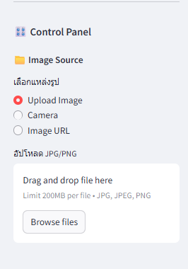
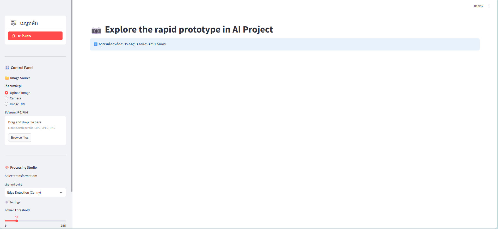
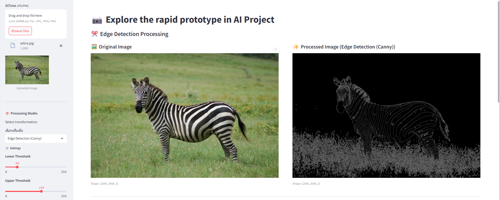
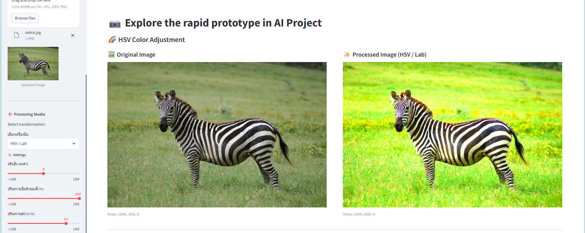
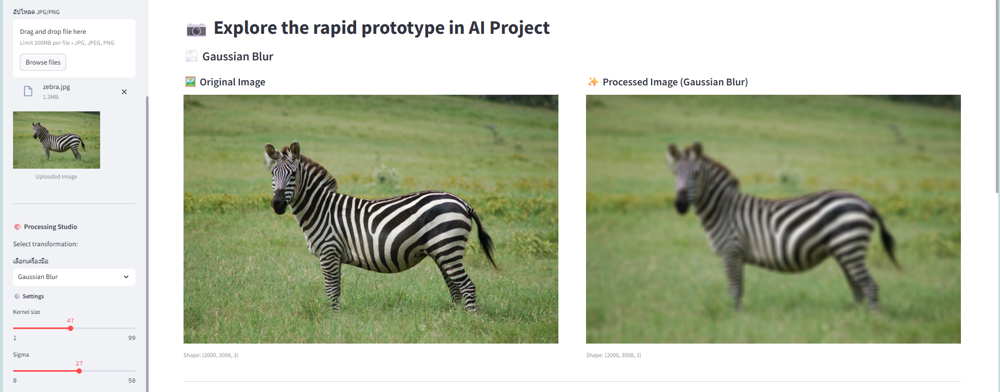
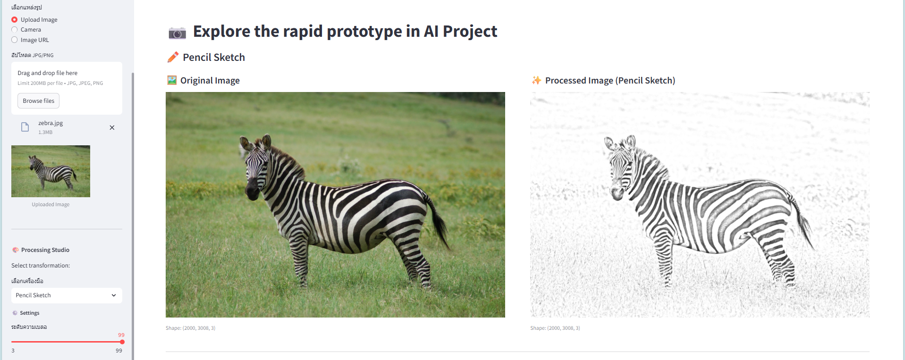
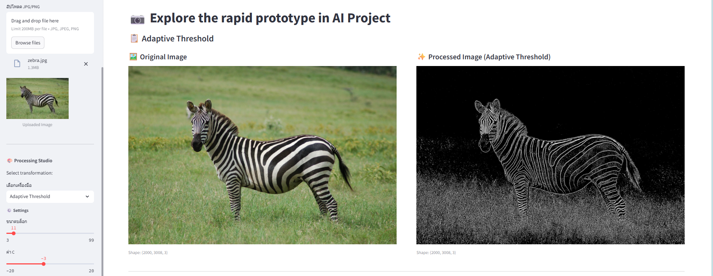
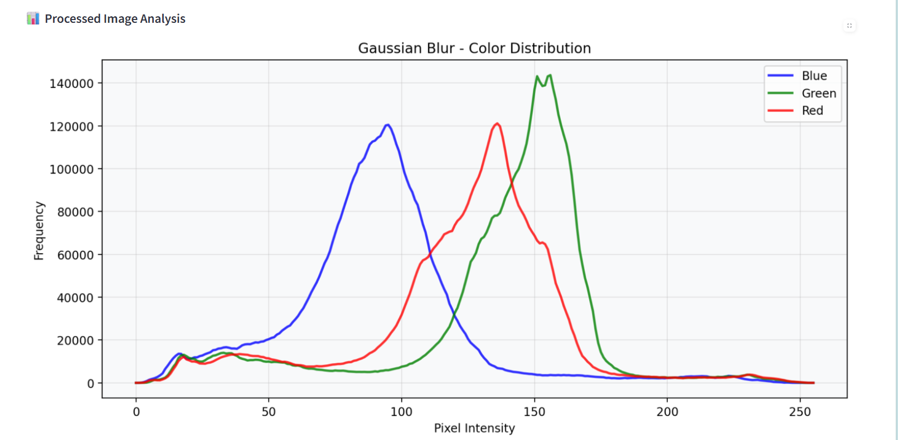

# โปรแกรมประมวลผลภาพ - Image Processing Lab
**ชื่อ:** นางสาว นริสรา แผ้วไพรี **รหัสนักศึกษา:** 6510110092

## ✨ คุณสมบัติหลัก

### 📸 แหล่งรับภาพ
<p align="center">
  
</p>

- **อัปโหลดไฟล์** : รองรับไฟล์ JPG, JPEG, PNG
- **URL จากอินเทอร์เน็ต** : โหลดภาพจาก URL ใดก็ได้บนเว็บ
- **เว็บแคมและกล้อง** : ถ่ายภาพโดยตรงจากกล้องของอุปกรณ์

### 🔧 เครื่องมือประมวลผลภาพ
- **ตรวจจับขอบ (Edge Detection)** : ใช้ Canny edge detection พร้อมการปรับแต่งค่าได้
- **ปรับสี HSV** : ควบคุมฮิว ความอิ่มตัวของสี และความสว่าง
- **เบลอแบบ Gaussian** : สร้างเอฟเฟกต์เบลอนุ่มนวลปรับระดับได้
- **Pencil Sketch** : แปลงภาพเป็นสเก็ตช์ดินสอ
- **Adaptive Threshold** : แปลงเป็นภาพขาวดำด้วยการปรับเกณฑ์อัตโนมัติ

### 🎛️ ส่วนควบคุม GUI แบบโต้ตอบ
- **ปรับค่าแบบเรียลไทม์** : ดูผลลัพธ์ทันทีเมื่อเปลี่ยนค่า
- **สไลเดอร์ควบคุม** : ปรับแต่งพารามิเตอร์แบบง่ายๆ
- **เลือกการประมวลผล** : เมนูแบบเลื่อนลงสำหรับเอฟเฟกต์ต่างๆ
- **อินเทอร์เฟซปรับตัวได้** : ใช้งานได้ทั้งคอมพิวเตอร์และมือถือ

### 📊 การแสดงผลและการวิเคราะห์
- **เปรียบเทียบแบบเคียงข้าง** : แสดงภาพต้นฉบับและภาพที่ประมวลผลแล้ว
- **ฮิสโทแกรมแบบโต้ตอบ** : วิเคราะห์การกระจายสีด้วย Matplotlib
- **สถิติภาพ** : วิเคราะห์ค่าพิกเซลอย่างครอบคลุม
- **วิเคราะห์ช่องสี** : แยกวิเคราะห์ช่องสี BGR แต่ละช่อง

### 📈 การแสดงข้อมูลเป็นกราฟ
- **กราฟการกระจายสี** : ฮิสโทแกรมแสดงการกระจายความเข้มของพิกเซล
- **วิเคราะห์หลายช่องสี** : แสดงแยกสำหรับช่องสีน้ำเงิน เขียว แดง (BGR)
- **ฮิสโทแกรมประมวลผล** : การกระจายความเข้มสำหรับภาพที่ประมวลผลแล้ว
- **อัปเดตเรียลไทม์** : กราฟเปลี่ยนแปลงอัตโนมัติตามการประมวลผล

## 📋 ขั้นตอนการใช้งานพื้นฐาน
1. **อัปโหลดภาพ** : เลือกจากไฟล์ในเครื่อง ถ่ายจากกล้อง หรือใส่ URL ภาพ
2. **เลือกการประมวลผล** : เลือกจากตัวเลือกประมวลผลภาพที่มี
3. **ปรับพารามิเตอร์** : ใช้สไลเดอร์เพื่อปรับแต่งการตั้งค่า
4. **ดูผลลัพธ์** : เปรียบเทียบภาพต้นฉบับและภาพที่ประมวลผลแล้ว
5. **วิเคราะห์ข้อมูล** : ตรวจสอบฮิสโทแกรมและสถิติ
6. **ส่งออก** : ดาวน์โหลดภาพที่ประมวลผลแล้ว

## 🔧 ตัวเลือกการประมวลผล
### หน้าแรกของระบบ
<p align="center">
  
</p>

### 🔍 Edge Detection (Canny)
<p align="center">
  
</p>

- **เกณฑ์ต่ำ** : 0-255 (ค่าเริ่มต้น: 50)
- **เกณฑ์สูง** : 0-255 (ค่าเริ่มต้น: 150)
- ใช้อัลกอริทึม Canny edge detection สำหรับการระบุขอบที่แม่นยำ

### 🌈 HSV Color Adjustment
<p align="center">
  
</p>

- **ปรับฮิว** : -180 ถึง +180 องศา (ค่าเริ่มต้น: 0)
- **ความอิ่มตัวของสี** : -100 ถึง +100% (ค่าเริ่มต้น: 0)
- **ความสว่าง** : -100 ถึง +100% (ค่าเริ่มต้น: 0)

### 🌫️ Gaussian Blur
<p align="center">
  
</p>

- **ขนาด Kernel** : 1-99 (ค่าเริ่มต้น: 5, เลขคี่เท่านั้น)
- **ค่า Sigma** : 0-50 (ค่าเริ่มต้น: 0)
- ใช้ตัวกรอง Gaussian blur สำหรับเอฟเฟกต์ศิลปะที่นุ่มนวล

### ✏️ Pencil Sketch
<p align="center">
  
</p>

- **ระดับความเบลอ** : 3-99 (ค่าเริ่มต้น: 21, เลขคี่เท่านั้น)
- แปลงภาพเป็นสเก็ตช์ดินสอแบบศิลปะ

### 📋 Adaptive Threshold
<p align="center">
  
</p>

- **ขนาดบล็อก** : 3-99 (ค่าเริ่มต้น: 11, เลขคี่เท่านั้น)
- **ค่า C** : -20 ถึง +20 (ค่าเริ่มต้น: 2)
- แปลงเป็นภาพขาวดำด้วยการปรับเกณฑ์อัตโนมัติแบบท้องถิ่น

## 📱 UX/UI

### 🎛️ แผงควบคุม (Sidebar)
- **การเลือกแหล่งภาพ** : ตัวเลือกอัปโหลด กล้อง หรือใส่ URL
- **ควบคุมการประมวลผล** : สไลเดอร์และเมนูเลือกพารามิเตอร์
- **ข้อมูลช่วยเหลือ** : คำแนะนำการใช้งานและเทคนิคต่างๆ
- **ภาพตัวอย่าง** : แสดงภาพที่อัปโหลดแล้วขนาดเล็ก

### 📊 แดชบอร์ดหลัก
- **การแสดงภาพ** : เปรียบเทียบภาพต้นฉบับและภาพที่ประมวลผลแล้ว
- **การแสดงฮิสโทแกรม** : กราฟการกระจายสีแบบโต้ตอบ
- **แผงสถิติ** : การวิเคราะห์ภาพอย่างละเอียด
- **ควบคุมการส่งออก** : ปุ่มดาวน์โหลดสำหรับภาพที่ประมวลผลแล้ว

### 🌊 คุณสมบัติการออกแบบ
- **อินเทอร์เฟซภาษาไทย** : เมนูและคำแนะนำเป็นภาษาไทย
- **การออกแบบที่เรียบง่าย** : ใช้งานง่าย เข้าใจได้ทันที
- **Responsive Design** : ปรับขนาดได้ตามหน้าจอ
- **Real-time Processing** : ประมวลผลและแสดงผลแบบเรียลไทม์

## 📊 การวิเคราะห์ข้อมูล
<p align="center">
  
</p>

### ฮิสโทแกรมแบบโต้ตอบ
- **แกน X** : ความเข้มพิกเซล (0-255)
- **แกน Y** : จำนวนความถี่
- **หลายช่องสี** : แสดงแยกสำหรับช่องสี Blue, Green, Red
- **อัปเดตเรียลไทม์** : รีเฟรชอัตโนมัติเมื่อเปลี่ยนพารามิเตอร์

## 🛠️ เทคโนโลยีที่ใช้

- **Streamlit** : Framework สำหรับสร้าง Web Application
- **OpenCV** : ไลบรารีประมวลผลภาพ
- **PIL (Pillow)** : ไลบรารีจัดการภาพ
- **NumPy** : ไลบรารีคำนวณทางวิทยาศาสตร์
- **Matplotlib** : ไลบรารีสร้างกราฟและแผนภูมิ
- **streamlit-option-menu** : เมนูนำทางแบบสวยงาม

## 📦 การติดตั้งและการใช้งาน

### ความต้องการของระบบ
```
Python 3.7+
streamlit
opencv-python
pillow
numpy
matplotlib
streamlit-option-menu
streamlit-img-label
```

### การติดตั้ง
```bash
pip install streamlit opencv-python pillow numpy matplotlib streamlit-option-menu streamlit-img-label
```

### การรันโปรแกรม
```bash
streamlit run app7.py
```

## 📝 หมายเหตุ
- โปรแกรมรองรับภาพขนาดใหญ่ โดยจะปรับขนาดอัตโนมัติสำหรับการแสดงผล
- การประมวลผลจะดำเนินการแบบเรียลไทม์เมื่อปรับพารามิเตอร์
- ภาพที่ดาวน์โหลดจะเป็นรูปแบบ PNG คุณภาพสูง

---
